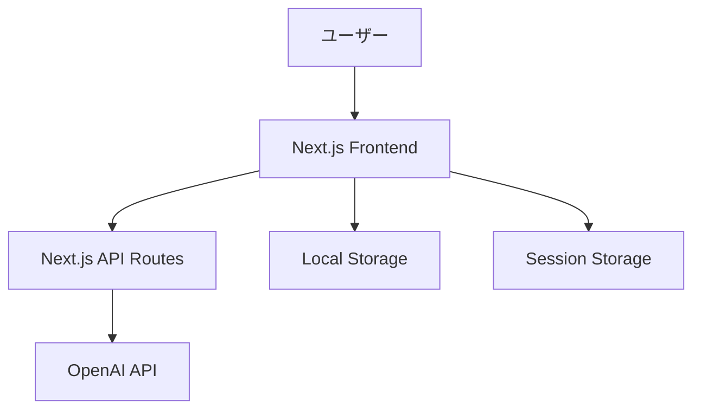

# 内省の時間 - 技術設計書

## 1. システムアーキテクチャ



## 2. フロントエンド設計

### 2.1 主要コンポーネント
- `AppLayout`: 全体レイアウト
- `IntrospectionSession`: 内省セッション管理
- `PoemGenerator`: 詩生成UI
- `ConversationHistory`: 会話履歴表示
- `SettingsPanel`: 設定画面

### 2.2 状態管理
- Zustandを使用したグローバル状態管理
- 主要な状態:
  ```typescript
  interface AppState {
    session: {
      messages: ChatMessage[]
      poemStyle: 'free' | 'tanka' | 'haiku'
      isActive: boolean
    }
    settings: {
      theme: 'light' | 'dark'
      fontSize: number
    }
  }
  ```

## 3. API設計

### 3.1 対話API (`POST /api/conversation`)
```typescript
interface ConversationRequest {
  messages: ChatMessage[]
  poemStyle?: 'free' | 'tanka' | 'haiku'
}

interface ConversationResponse {
  response: string
  poem?: string
}
```

### 3.2 詩生成API (`POST /api/generate-poem`)
```typescript
interface PoemRequest {
  context: string
  style: 'free' | 'tanka' | 'haiku'
}

interface PoemResponse {
  poem: string
  analysis: string
}
```

## 4. セキュリティ設計

### 4.1 データ保護
- セッションデータはブラウザのSession Storageに保存
- ブックマークデータはLocal Storageに保存
- データ暗号化は行わない（永続化しないため）

### 4.2 API保護
- API RoutesにCORS設定
- レートリミット設定（Vercel Edge Functions利用）
- OpenAI APIキーは環境変数で管理

## 5. パフォーマンス最適化

### 5.1 キャッシュ戦略
- 詩生成結果の一時キャッシュ（5分間）
- ブラウザ側キャッシュ制御

### 5.2 レンダリング最適化
- React.memoを使用したコンポーネント最適化
- 遅延読み込み（React.lazy）
- コード分割（Next.js自動対応）

## 6. テスト戦略

### 6.1 単体テスト
- Jest + React Testing Library
- 主要コンポーネントのテストカバレッジ80%以上

### 6.2 E2Eテスト
- Cypressを使用
- 主要ユースケースの自動テスト

## 7. デプロイ戦略

### 7.1 環境構成
- 本番環境: Vercel
- ステージング環境: Vercel Preview
- CI/CD: GitHub Actions

### 7.2 監視
- Vercel Analytics
- Sentry（エラートラッキング）
- Logrocket（ユーザー行動分析）

## 8. 技術スタック

### 8.1 主要技術
- Next.js 14
- TypeScript 5
- Tailwind CSS 3
- Zustand 4
- OpenAI API

### 8.2 開発ツール
- ESLint + Prettier
- Husky + lint-staged
- Commitizen
- Storybook
